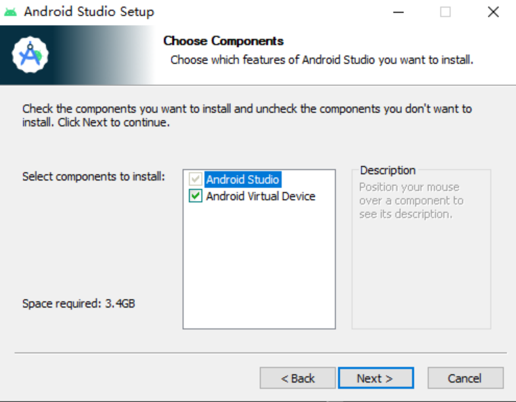

### 选择IDE
#### 1.IDEA
https://www.jetbrains.com/idea/download/?section=windows
#### 2.Android studio
https://developer.android.google.cn/studio/
### 安装SDK
#### 1.IDEA
在IDEA新建Android项目时，根据引导安装SDK
#### 2.Android studio
在第一次启动时，通过引导后会自动安装
### 安装AVD
#### 1.IDEA
创建完项目后在Device Manager里面创建虚拟机
  
#### 2.Android studio
安装时勾上即可  
  
### 新建项目
以IDEA为例，我们这里选择Empty Views Activity    
    
如果选择的模板没有Language这个选项，默认会是Kotlin，换一个模板即可。    
Minimum SDK建议选择API 21或API 30。    
    
项目加载完之后，如果SDK和AVD没有问题在运行后就会出现你的虚拟机了  
  
### 项目结构
重要文件和文件夹  
```
app
 |--src
 |   |--build.gradle.kts或build.gradle ——app项目设置
 |   |--main
 |       |--AndroidManifest.xml ——app信息描述文件
 |       |--java ——存放java源文件
 |       |--res
 |           |--drawable ——存放组件xml和位图等资源文件
 |           |--layout ——存放布局文件
 |           |--values ——存放全局变量
```
#### 1.AndroidManifest.xml
每个activity需要在AndroidManifest.xml里面注册    
指定了intent-filter的action和category的activity会在app启动时启动  
```
<!--app启动时的第一个activity-->
<activity
    android:name=".MainActivity"
    android:exported="true">
    <intent-filter>
        <action android:name="android.intent.action.MAIN"/>
        <category android:name="android.intent.category.LAUNCHER"/>
    </intent-filter>
</activity>
<!--其他activity-->
<activity android:name=".LoginActivity"/>
<activity android:name=".RegisterActivity"/>
```
#### 2.build.gradle.kts或build.gradlew
需要其他工具的帮助的话直接在此文件的dependencies里添加对应的implementation    
例如：  
```
dependencies {
    ......
    implementation 'com.alibaba:fastjson:2.0.28'
    ......
}
```
### Activity
#### 生命周期
    
点击模板生成的MainActivity里面onCreate函数旁边的按钮导航到FragmentActivity可以找到许多on开头的函数，这些函数就是Activity生命周期的函数，可以通过重写这些函数来达到想要的效果。  
其中最主要的onCreate函数在Activity创建时调用，主要用于初始化。    
其他的on函数根据需要自行看注解去重写。    
    
#### XML
每个Activity需要在onCreate的时候绑定一个XML文件，将其编译成View资源以便绘制、调用。  
```
setContentView(R.layout.activity_main);
```
使用findViewById就能获取View的信息进行各种操作。  
```
Button button = findViewById(R.id.button_login);
```
可先参考这个网站[https://developer.android.google.cn/guide/topics/ui/declaring-layout?hl=zh-cn](https://developer.android.google.cn/guide/topics/ui/declaring-layout?hl=zh-cn)  
每个界面是由许多View构成，这些View以一些布局方式分布在屏幕上，而XML就是描述这些信息的一种方式。  
XML文件与HTML文件相似，由一个个标签嵌套组成。    
举个例子：  
```xml
<?xml version="1.0" encoding="utf-8"?><!--xml头-->
<!--布局-->
<RelativeLayout
        xmlns:android="http://schemas.android.com/apk/res/android"
        xmlns:tools="http://schemas.android.com/tools"
        android:layout_width="match_parent"
        android:layout_height="match_parent"
        tools:context=".MainActivity">
    <!--文字-->
    <TextView
            android:layout_width="wrap_content"
            android:layout_height="wrap_content"
            android:text="Hello World!"/>
</RelativeLayout>
```
一个标签以`<标签名`开头，然后是它的属性，一般以`android:`或`tool:`开头，如果这个标签不包含其他标签则以`/>`结尾，否则以`>...</标签名>`结尾。    
常用的布局有LinearLayout，RelativeLayout。常用的组件有TextView，ImageView。这些都以标签的形式写在XML文件中。    
以下用一个例子详细介绍XML的构成。  
  
  
这个例子中，将中间三块当做整体，那最外面就可以用RelativeLayout。  
```xml
<RelativeLayout>
    <LinearLayout
            ......
            android:layout_centerHorizontal="true"
            android:layout_above="@+id/game_board">...</LinearLayout>
    <LinearLayout
            ......
            android:id="@+id/game_board"
            android:layout_centerInParent="true">...</LinearLayout>
    <LinearLayout
            ......
            android:layout_centerHorizontal="true"
            android:layout_below="@+id/game_board">...</LinearLayout>
</RelativeLayout>
```
  
上面的部分是一个水平的LinearLayout里面包含两个竖直的LinearLayout。    
```xml
<LinearLayout
            android:layout_centerHorizontal="true"
            android:layout_above="@+id/game_board">
        <LinearLayout
                ...
                android:orientation="vertical">
            <TextView
                    ...
                    android:text="最高分"/>
            <TextView
                    ...
                    android:text="2587418"/>
        </LinearLayout>
        <LinearLayout
                ...
                android:orientation="vertical">
            <TextView
                    ...
                    android:text="当前分数"/>
            <TextView
                    ...
                    android:text="1478528"/>
        </LinearLayout>
    </LinearLayout>
```
中间的部分可以用LinearLayout嵌套实现。   
```xml
<LinearLayout
            ...
            android:id="@+id/game_board"
            android:layout_centerInParent="true"
            android:orientation="vertical">
        <LinearLayout>
            <TextView/><TextView/><TextView/><TextView/>
        </LinearLayout>
        <LinearLayout>
            <TextView/><TextView/><TextView/><TextView/>
        </LinearLayout>
        <LinearLayout>
            <TextView/><TextView/><TextView/><TextView/>
        </LinearLayout>
        <LinearLayout>
            <TextView/><TextView/><TextView/><TextView/>
        </LinearLayout>
    </LinearLayout>
```
下面的部分是一个水平的LinearLayout被两个文本占满。    
```xml
<LinearLayout
            ...
            android:layout_centerHorizontal="true"
            android:layout_below="@+id/game_board">
        <TextView
                ...
                android:text="重置"
                android:layout_weight="1"/>
        <TextView
                ...
                android:text="退出"
                android:layout_weight="1"/>
</LinearLayout>
```
