# C++ 游戏开发入门

> For BUAA 2023 Summer Semester
>
> Copyright ©️ Tony's Studio 2023

---

# 〇、引言

本文将介绍 Windows 下的 C++ 游戏开发入门知识，主要使用 EasyX。同时，也会介绍游戏开发的一些通用内容，比如游戏框架接口等。本文内容更多是概念的介绍，具体的[开发案例](#5-3-游戏开发实战)在最后一节，其中包括一个完整的开发过程案例。

---

# 一、初识 Windows 图形界面

## 1.1 什么是 Windows GDI？

Windows GDI (Graphics Device Interface) 是 Windows 窗体程序的基础，传统的图形化界面都是通过它实现的。

>  关于 Windows GDI 的更多内容详见 Microsoft 官方文档。
>
>  - [Windows GDI](https://learn.microsoft.com/zh-cn/windows/win32/gdi/windows-gdi)（中文）
>  - [Windows GDI](https://learn.microsoft.com/en-us/windows/win32/gdi/windows-gdi)（English）

## 1.2 什么是 EasyX？

“EasyX Graphics Library 是针对 Visual C++ 的免费绘图库，支持 VC6.0 ~ VC2022，简单易用，学习成本极低，应用领域广泛。目前已有许多大学将 EasyX 应用在教学当中。” （摘自 [EasyX 官网](https://easyx.cn/)。）

EasyX 是对 Windows GDI 的封装，使 Windows 下的绘图操作更加简便。

---

# 二、 安装 EasyX

> EasyX 目前主流支持 Visual Studio 开发环境，对于其他开发工具需要额外安装配置。具体配置方法可参考这篇文章。
>
> - [在 CLion、Dev-C++ 或 Code::Blocks 下面配置 EasyX](https://codebus.cn/bestans/easyx-for-mingw)

## 2.1 安装 Microsoft Visual Studio

> 抱歉，我没有使用过 Visual Studio 的中文语言包，因此我不确定选项对应的中文翻译，只好使用英文原文。🙏🏼

Visual Studio 的具体安装步骤详见官方文档。

- [安装 Visual Studio](https://learn.microsoft.com/zh-cn/visualstudio/install/install-visual-studio?view=vs-2022)（中文）
- [Install Visual Studio](https://learn.microsoft.com/en-us/visualstudio/install/install-visual-studio?view=vs-2022)（English）

版本选择 Visual Studio 2022 Community 即可。EasyX 最新版本不再支持 VS 预览版，如果你之前没有安装 Visual Studio，并且没有对预览版的需求，选择正式版下载即可。如果你已经安装了，或想要安装预览版，之后选择稍旧版本的 EasyX 即可。

安装时，若无其他需求，Workloads 选择下图中这一项即可。

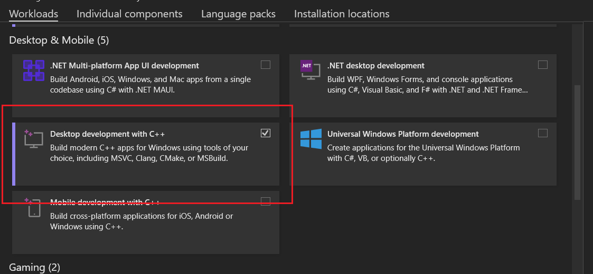

## 2.2 安装 EasyX

> 更多内容可以参考 EasyX 官网。
>
> - [EasyX 更新日志](https://easyx.cn/easyx)
> - [怎样安装 EasyX？](https://easyx.cn/setup)
> - [手动安装 EasyX](https://docs.easyx.cn/zh-cn/setup)

EasyX 最新的几个安装包链接如下，其中 2023 大暑版不再支持 VS 预览版。如果你使用预览版，选择其他版本即可。

- [EasyX_2023大暑版](https://easyx.cn/download/EasyX_2023大暑版.exe)
- [EasyX_20220901 （上个稳定版本）](https://easyx.cn/download/EasyX_20220901.exe)
- [EasyX_20200902 （上个稳定版本）](https://easyx.cn/download/EasyX_20200902.exe)

安装包比较朴实无华。😉

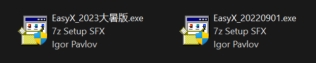

运行后，安装包会自动检测 Visual Studio 版本，点击安装即可。 根据需要，可以保留该安装包，以便后续卸载使用。（不同版本的卸载是通用的。）

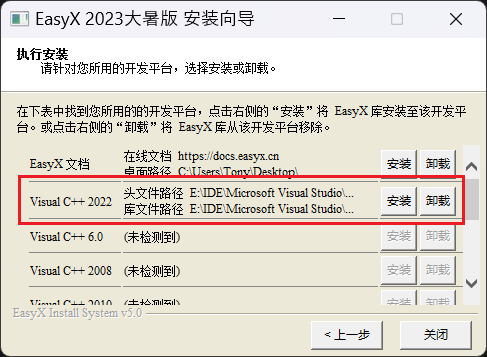

---

# 三、EasyX 的基本使用

> 该部分仅介绍最基本的使用方法，更多内容请参考官方文档。

## 3.1 阅读文档

阅读文档总是学习新技术的好方式，EasyX 也是一样。EasyX 的官方在线文档如下，你也可以在页面内下载离线文档。

- [EasyX 在线文档](https://docs.easyx.cn/zh-cn/)

文档为最新版本，和旧版本可能会有少许出入，但几乎没有影响。

## 3.2 基本概念

### 3.2.1 C or C++ ？

EasyX 使用 C++ 对 Windows GDI 进行封装，因此只支持使用 C++ 开发。不过，尽管使用了 C++，其并没有大量使用 C++ 的特性，因此使用体验上与 C 差别不大，完全使用 C 语言作为 C++ 的子集也是可以的。但是，C++ 毕竟不是 C，还是推荐学习一些 C++ 知识，尤其是基本的 STL 使用，可以极大方便程序的编写。

### 3.2.2 头文件

EasyX 提供了两个头文件，`easyx.h` 和 `graphics.h`。`graphics.h` 包含 `easyx.h`，同时支持旧接口。如果不考虑与旧版本 EasyX 的兼容性，推荐使用 `easyx.h`。

### 3.2.3 基本使用

在 Windows 控制台项目中，书写以下代码。

```cpp
#include <easyx.h>	// 引用 EasyX 头文件
#include <conio.h>  // Windows 控制台输入输出头文件

int main()
{
    initgraph(640, 480);    // 创建绘图窗口，大小为 640x480 像素
    circle(200, 200, 100);  // 画圆，圆心(200, 200)，半径 100
    _getch();               // 按任意键继续（控制台非缓冲输入，对应缓冲输入中的 getchar）
    closegraph();           // 关闭绘图窗口
    return 0;
}
```

编译运行后结果如下图。

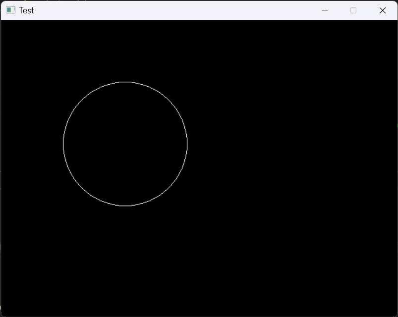

基本使用就到此为止了，EasyX 的文档写得很全面，官网也有很多范例可以参考。

- [CodeBus](https://codebus.cn/)（EasyX 范例程序网站）

---

# 四、窗口 VS 控制台

## 4.1 基本概念

在 Windows 开发中，有两种基本的项目类型，控制台程序（Console Application）和窗口程序（Desktop Application），大家之前写的“黑框框”就是控制台程序。现在，为了使游戏更具有更好的效果，我们可以选择创建窗口程序。

> 事实上，EasyX 也可以在控制台程序中使用，正如 3.2.3 中的示例程序一样。但是由于 Windows 使用 Terminal 替代了 Console Host 作为控制台的默认程序，因此运行后任务栏会出现两个图标（即两个进程），不太美观，而且会导致窗口进程无法接收到控制台输入消息（使用控制台项目的好处就是能使用控制台输入）。因此不如直接创建窗口程序项目，尽管会因此失去控制台输入输出能力。
>
> 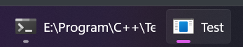

这两种项目类型在创建项目时的选项如下。

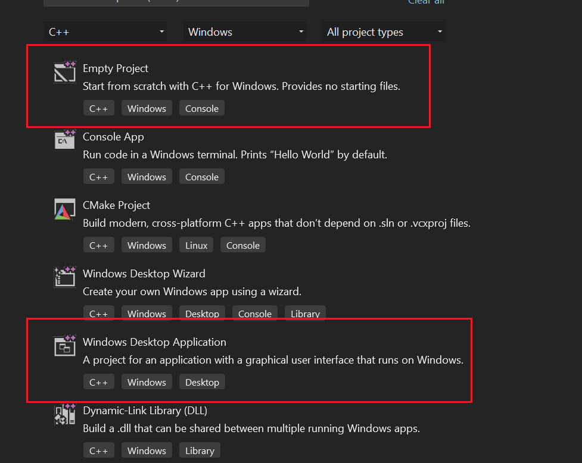

## 4.2 创建 Windows 窗口程序

> Windows 控制台程序的使用方式不再赘述，相信大家已经很熟悉了。EasyX 官网只提供了 VS 2010 的使用方式，不过差别不大（可能还是有点大？）。
>
> - [EasyX 使用演示 - 在 VC2010 的窗口程序中使用 EasyX](https://easyx.cn/used-in-vc2010-win32)

### 4.2.1 新建项目

创建新项目，选择 4.1 中的 Windows Desktop Application，在接下来的配置中，填写你喜欢的项目名称和路径即可。

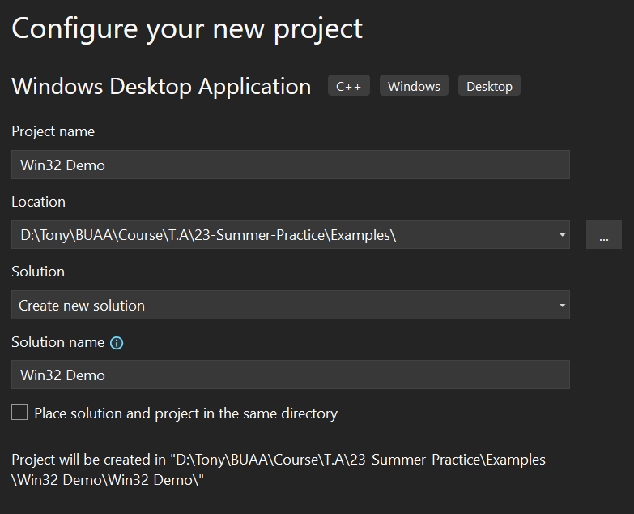

> Visual Studio 以 Solution（解决方案）和 Project（工程）的形式管理项目，一个 Solution 可以包含多个 Project。如果你只有一个 Project，可以勾选"Place solution and project in the same directory"。

### 4.2.2 调整模板

新建项目后，Visual Studio 会默认创建项目模板，但是这不是我们想要的，因此我们需要进行一些调整。（可以先编译运行一下，看看窗口程序长什么样子。）

首先，在 Solution Explorer 窗口中，勾选 "Show All Files"，因为 C++ 项目默认的筛选器会隐藏部分文件。然后删除 `.cpp` 文件之外的其他所有文件（源文件名会因 Project 名称而异）。

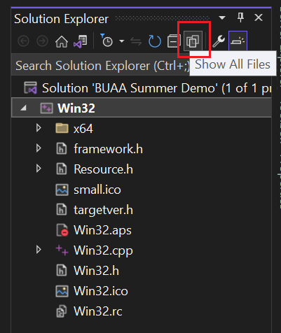

删除后如下图。

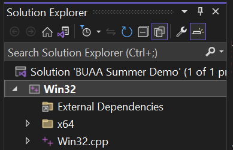

接下来，打开 `.cpp`，将内容替换为如下代码，编译运行，即可得到 3.2.3 中的图像。

```cpp
    #include <Windows.h>
    #include <easyx.h>

    int APIENTRY WinMain(
        _In_ HINSTANCE hInstance,
        _In_opt_ HINSTANCE hPrevInstance,
        _In_ LPSTR lpCmdLine,
        _In_ int nShowCmd)
    {
        initgraph(640, 480);    // 创建绘图窗口，大小为 640x480 像素
        circle(200, 200, 100);  // 画圆，圆心(200, 200)，半径 100

        // _getch();            // 窗口程序无法使用控制台输入输出
        Sleep(5000);            // 延时 5000 毫秒（声明在 Windows.h 中）

        closegraph();           // 关闭绘图窗口
        return 0;
    }
```

### 4.2.3 后续编写

有了 EasyX 的 `initgraph()` 函数以及其他消息处理函数，我们不再需要关心繁琐的 Windows 窗口注册，以及消息接收，因此除了调用 EasyX 的函数外，和普通的控制台程序编写没有太大的区别。😍

----

# 五、游戏开发入门

> 这里介绍从 0 开始的游戏开发，不涉及游戏引擎的使用，但是会介绍基础的游戏框架。篇幅原因，这里仅涉及最基础的内容，更多内容还请同学们自行探索。 

## 5.1 项目结构与配置

### 5.1.1 项目结构

这里给出一个简单的项目文件接口，仅供参考，最终还是以方便管理为目的。这里，将所有 C++ 源文件 `.cpp` 放在 `src\` 目录下，将所有头文件 `.h` 放在 `inc\` 目录下，所有资源文件（图片、数据等）放在 `res\` 目录下。

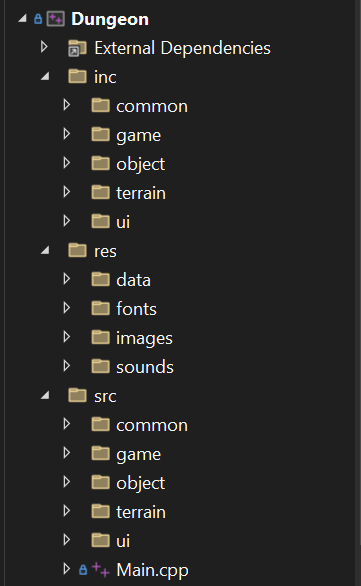

其中，`Main.cpp` 仅作为程序入口，完整内容如下。当然，作为小项目，可以在该文件中多写一些逻辑。

```cpp
#include <Windows.h>
#include "../inc/game/Startup.h"
int APIENTRY WinMain(
	_In_ HINSTANCE hInstance,
	_In_opt_ HINSTANCE hPrevInstance,
	_In_ LPSTR lpCmdLine,
	_In_ int nShowCmd)
{
	if (!Initialize())
		return -1;
	Run();
	ClearUp();
	return 0;
}
```

### 5.1.2 项目配置

> 为了方便开发，可以在 Visual Studio 中对项目的各种目录进行配置。这里列出了最基本的一些配置，更多内容目前可能还用不到，可以在将来自行探索。

#### 5.1.2.1 输出路径

在菜单栏的 Project 选项下，找到项目属性。

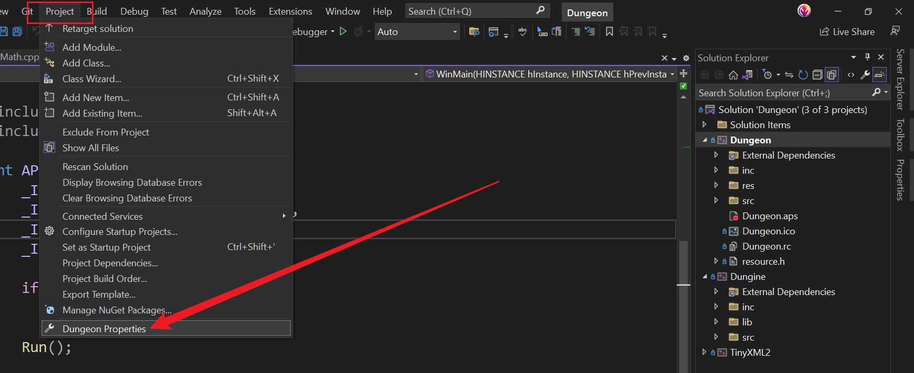

在项目属性中，可以设置 Output Directory，即最终的可执行文件（`.exe`）的输出路径，以及编译时的临时文件输出路径（方便手动删除，尤其是包含多个 Project 的情况）。根据个人情况选择即可，此处仅供参考。

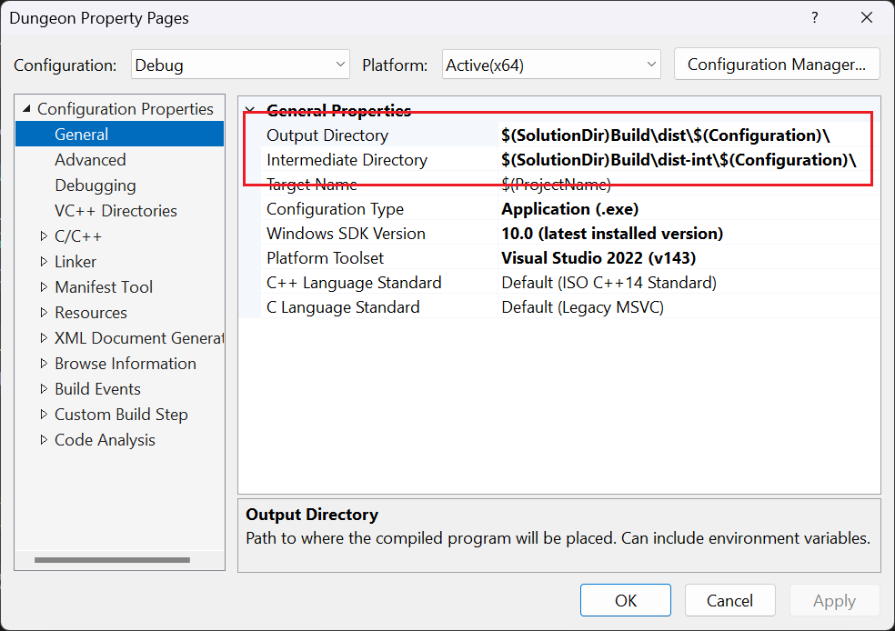

#### 5.1.2.2 字符集

推荐选择 Unicode 字符集，尤其是你想在程序中使用中文的话。

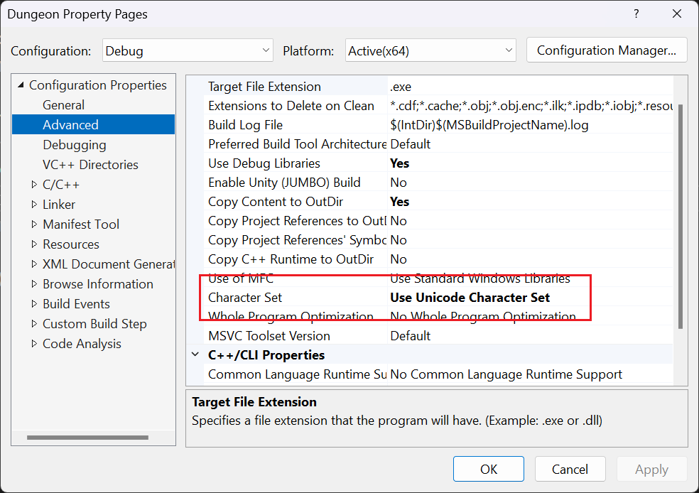

> 更多关于 MBCS 和 Unicode 的内容，可以参考这篇文章，其中也包含了 EasyX 中文字的输出。
>
> - [在程序中正确使用 Unicode 和 MBCS 字符集](https://codebus.cn/yangw/about-unicode)

#### 5.1.2.3 工作路径

使用 Visual Studio 运行程序时，默认的工作路径是项目所在的路径（即 `$(ProjectDir)`），你可能不想让程序在这里运行，因为存档文件之类的可能需要相对路径。因此，可以在这里进行修改。

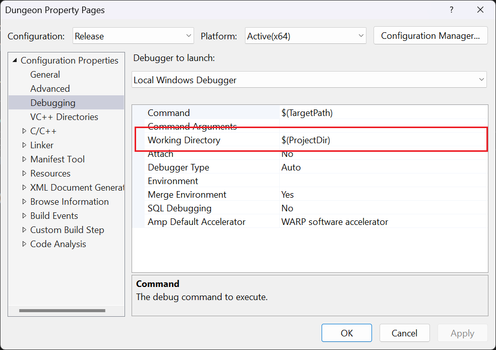

## 5.2 游戏框架

对于简单的游戏来说，其运行的基本流程如下图所示。

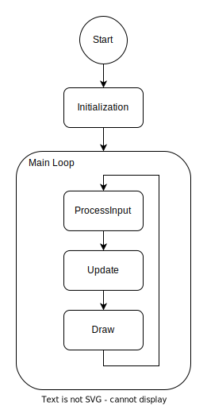

首先，是游戏开始前的初始化，此处主要是加载各种资源，如图片等。加载好之后，就会进入游戏主界面。

> 要做好游戏界面的切换也不容易，因此这里不做进一步说明。

进入游戏后，则是一个主循环，在循环内部，首先接收用户输入，然后根据输入和游戏状态，对游戏内各个对象进行更新，最后将更新好的内容绘制在屏幕上，如此反复，就是一个简单的游戏了。

## 5.3 游戏开发实战

### 5.3.1 入门项目案例

为了方便大家快速入门，我录制了视频，可以在 BiliBili 上观看。😉

视频链接：[BiliBili: C++ EasyX 游戏开发入门](https://www.bilibili.com/video/BV1Wr4y1Z7aX/)

分集列表：

1. [简介](https://www.bilibili.com/video/BV1Wr4y1Z7aX?p=1)
2. [游戏设计](https://www.bilibili.com/video/BV1Wr4y1Z7aX?p=2)
3. [创建项目](https://www.bilibili.com/video/BV1Wr4y1Z7aX?p=3)
4. [基础类型实现](https://www.bilibili.com/video/BV1Wr4y1Z7aX?p=4)
5. [界面实现（上）](https://www.bilibili.com/video/BV1Wr4y1Z7aX?p=5)
6. [界面实现（下）](https://www.bilibili.com/video/BV1Wr4y1Z7aX?p=6)
7. [游戏对象实现（上）](https://www.bilibili.com/video/BV1Wr4y1Z7aX?p=7)
8. [游戏对象实现（下）](https://www.bilibili.com/video/BV1Wr4y1Z7aX?p=8)
9. [游戏界面实现](https://www.bilibili.com/video/BV1Wr4y1Z7aX?p=9)
10. [添加图片](https://www.bilibili.com/video/BV1Wr4y1Z7aX?p=10)
11. [添加声音](https://www.bilibili.com/video/BV1Wr4y1Z7aX?p=11)
12. [打包发布](https://www.bilibili.com/video/BV1Wr4y1Z7aX?p=12)

配套的项目代码可以在 GitHub 上找到：[PingPong Tutorial](https://github.com/Lord-Turmoil/PingPongTutorial)。

### 5.3.2 进阶项目案例

如果对 EasyX 开发游戏感兴趣，可以参考我做过的一个小项目，其中涉及了 EasyX 图像处理，FMOD 音频处理，以及借助了 TinyXML 的文件处理。此外，也包括一个简陋的游戏引擎。

- CodeBus 上的 [Dungeon](https://codebus.cn/turmoil/dungeon)
- GitHub 上的 [Dungeon](https://github.com/Lord-Turmoil/Dungeon)
- Gitee 上的 [Dungeon](https://gitee.com/tonys-studio/dungeon)

### 5.3.3 更多案例

更多 EasyX 使用案例请访问官网。

- [CodeBus](https://codebus.cn/)

---

开发愉快！🥳
