# Windows窗口应用-拼图游戏

## 1.案例简介

### 拼图游戏

简单的拼图游戏，在游戏窗口内通过点击上下左右四个移动键来移动空白块旁边的拼图，通过不断调整，直至完成整个拼图。

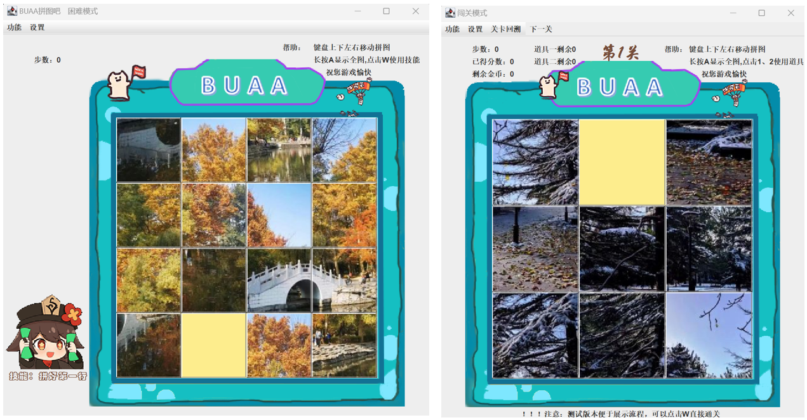

- 本案例采用Java语言，使用Jframe等类实现窗口的布局以及相关的核心功能。

- 基础的拼图相关代码量在800左右，扩展相关功能后共3000行代码。
  
  

## 2.需求分析

### 游戏的操作需求

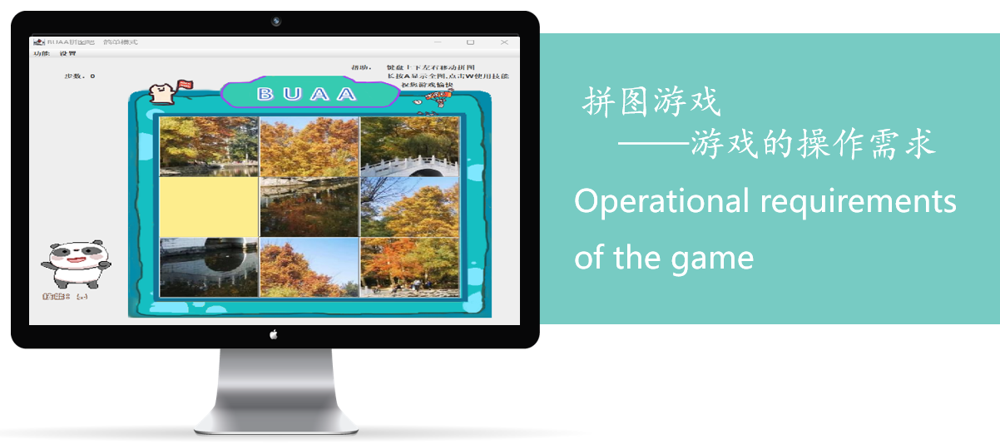

#### 游戏的开始与初始化

根据当前玩家的选择的难度，初始化一张拼图图片并按照对应难度的方式将其打乱。

#### 游戏的基本操作

使用键盘上的上下左右键进行拼图块在界面中的移动，完成对拼图的组装。

#### 游戏中的辅助功能

长按A显示全图，W完成当前拼图在菜单栏中选择更换图片，重新游戏，重选难度，开关音乐等操作。


### 游戏的算法需求

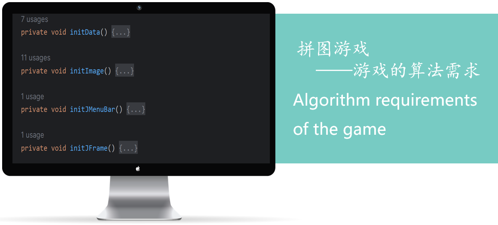

#### 初始化加载算法

获取相关的拼图资源，将每个拼图打乱并展示于游戏界面中。

#### 操作反应算法

每次使用上下左右方向键移动拼图时，判定当前位置能否支持该移动，如果可以则移动并记下步数，如果不行则不做出反应。

#### 胜利判断算法

每次移动结束后，判断当前界面的拼图是否已经完成，如果已经完成则显示胜利。


### 游戏的流程图

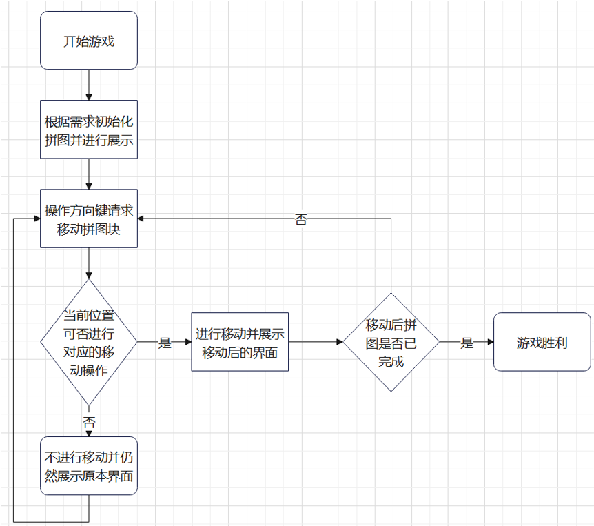


## 3.技术路线

### 需要具备的知识

- Java基础：
  Java程序设计语言的基本语法与面向对象知识的实际应用。

- Java内置框架：
  Java中系统框架的运用，纯Java完成的可视化窗口游戏需要使用Java中包含的Jframe类的框架完成。

- Java开发环境：
  常见Java开发环境的使用，如jetBrains发布的IntelliJ IDEA，科研版与社区版均可使用。

- Java代码优化：
  在一定程度上对代码进行封装，优化代码结构，降低耦合。高耦合和重复性内容会在修改时大大增加工作量。

### 参考资料

- 书籍资料
  可以参考《Java从入门到精通》、《Java基础入门-黑马程序员版》建议最好用电子版。

- 网页资料（推荐）
  推荐使用菜鸟教程：[Java 教程 | 菜鸟教程](https://www.runoob.com/java/java-tutorial.html)，除了Java也有别的教程。

- 视频资料
  可以在Bilibili或其他视频网站上学习尚学堂、黑马程序员等编程机构的视频。
  
  

总而言之，最为推荐的是菜鸟教程，网页版大家自己进行翻阅浏览，相比之下效率高。

### 编程环境推荐

在JetBrains官网上下载IDEA，网址为：[IntelliJ IDEA – the Leading Java and Kotlin IDE](https://www.jetbrains.com/idea/)，进行学生认证后可以免费下载科研版，如果不想认证，直接下载社区版目前而言也是十分够用的。


JetBrains的IntelliJ IDEA是一款强大的集成开发环境（IDE），专门用于Java编程。它在Java开发者社区中广受欢迎，因为它提供了许多高效、智能的工具和功能，可以大大提高开发效率。


## 4.程序设计

### 模块划分

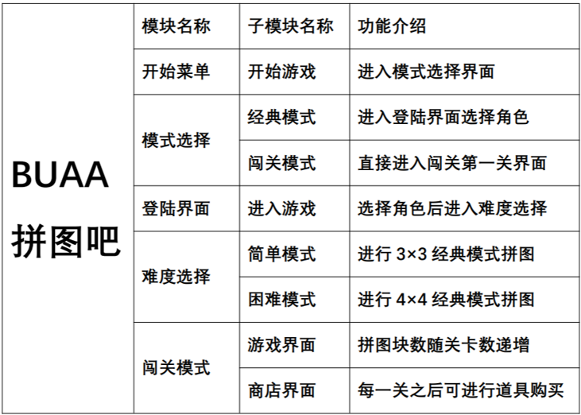

### 模块关系图

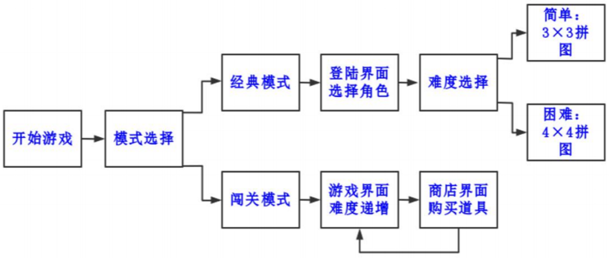

### 核心算法流程

#### initData算法解析

将图片分为0-8一共九张并标号之后，使用Random相关算法将其进行打乱，生成一组初始化的混乱拼图顺序，同时在打乱之后，记录下0号的位置给x和y，以方便在后续加载图像时对空白移动块进行加载。

```java
int x=0;
int y=0;//记录0号的位置
private void initData() {
    int[] tempArr={0,1,2,3,4,5,6,7,8};
    Random r=new Random();
    for (int i = 0; i < tempArr.length; i++) {
        int index=r.nextInt(8);
        int temp=tempArr[i];
        tempArr[i]=tempArr[index];
        tempArr[index]=temp;
    }
    int index=0;
    for (int i = 0; i < data.length; i++) {
        for (int j = 0; j < data[i].length; j++) {
            if(tempArr[index]==0){
                x=i;
                y=j;
            }
            data[i][j]=tempArr[index++];
        }
    }
}
```

#### initImage算法解析

首先清空当前界面，准备使用移动后的新数据开始加载，之后判断新数据是否已胜利，胜利则显示胜利画面。如果没有胜利，再将之前打乱的图片按顺序填入游戏界面中，最后将背景加载进界面。

```java
private void initImage() {
        this.getContentPane().removeAll();//清空当前界面内容，使下一次的内容成功显示
        if(victory()){
            JLabel winJLabel=new JLabel(new ImageIcon("..\\puzzlegame\\image\\win.png"));
            winJLabel.setBounds(303,283,197,73);
            this.getContentPane().add(winJLabel);
        }
        JLabel stepCount=new JLabel("步数："+step);
        stepCount.setBounds(50,30,100,20);
        this.getContentPane().add(stepCount);
        //路径简化：把项目名之前的路径写成..//方便代码在不同设备运行
        for (int i = 0; i <3; i++) {
            for (int j = 0; j < 3; j++) {
                int num=data[i][j];
                JLabel jLabel=new JLabel(new ImageIcon(path+num+".jpg"));//找到图片位置，创建图片管理容器并将图片放进去
                jLabel.setBounds(140*j+183,140*i+134,140,140);//设置位置
                jLabel.setBorder(new BevelBorder(BevelBorder.RAISED));//BevelBorder是边框类别（斜式边框），0是图片突起，改成1就是图片凹陷
                this.getContentPane().add(jLabel);//getContentPane调用窗口中隐藏容器，将jLabel加入
            }
        }
        ImageIcon bg=new ImageIcon("..\\puzzlegame\\image\\background4.png");
        JLabel background=new JLabel(bg);
        background.setBounds(140,40,508,560);
        this.getContentPane().add(background);
}
```

#### initJMenuBar算法解析

创建出当前界面的菜单栏，设置菜单栏中的各个项目，并在项目之后添加对应的内容，并在最后一级的子项目中添加点击后对应的具体算法，实现菜单的创建。

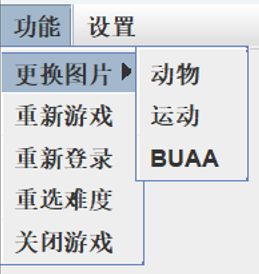

```java
private void initJMenuBar() {
        JMenuBar jMenuBar=new JMenuBar();//创建菜单栏

        JMenu functionJMenu=new JMenu("功能");
        JMenu aboutJMenu=new JMenu("设置");//创建菜单选项
        JMenu updatePhotoJMenu=new JMenu("更换图片");

        updatePhotoJMenu.add(animal);
        updatePhotoJMenu.add(sports);
        updatePhotoJMenu.add(special);

        functionJMenu.add(updatePhotoJMenu);
        functionJMenu.add(replayItem);
        functionJMenu.add(reLoginItem);
        functionJMenu.add(reChooseItem);
        functionJMenu.add(closeItem);//将子选项加入选项

        aboutJMenu.add(accountItem);//将子选项加入选项

        animal.addActionListener(this);
        sports.addActionListener(this);
        special.addActionListener(this);
        replayItem.addActionListener(this);
        reLoginItem.addActionListener(this);
        reChooseItem.addActionListener(this);
        closeItem.addActionListener(this);
        accountItem.addActionListener(this);//点击使用功能

        jMenuBar.add(functionJMenu);
        jMenuBar.add(aboutJMenu);//将选项加入菜单

        this.setJMenuBar(jMenuBar);//将菜单加入窗口
}
```

#### keyReleased算法解析

这是对Java库中的KeyListener类中的方法进行重写，是的界面可以监听到我们的键盘操作，通过获取当前点击的按键，判断是否能够移动，如果不能，直接返回。如果可以，则进行数组中数据的变化并重新展示界面。

```java
public void keyReleased(KeyEvent e) {
        if(victory()){
            return;
        }
        int code=e.getKeyCode();
        if(code==37){
            if(y==2){
                return;
            }
            //向左
            data[x][y]=data[x][y+1];
            data[x][y+1]=0;
            y++;
            step++;
            initImage();
        }else if(code==38){
            if(x==2){
                return;
            }
            //向上
            data[x][y]=data[x+1][y];
            data[x+1][y]=0;
            x++;
            step++;
            initImage();
        }else if(code==39){
            //...
        }else if(code==40){
            //...
        }
}
```


## 5.测试与部署

### 软件部署与发布

本案例项目属于Java本地程序项目，从界面设计到逻辑程序均只由Java代码完成。结构和功能较为简单，是适合于初学者使用的模型，有助于理解Java和面向对象编程。尚未涉及到较大规模的团队软件开发。同时也没有项目部署与发布方面的需求，只需要提供本地上的编译运行环境，即可启动运行程序。

### 软件测试

- 软件测试贯穿软件生命周期的全过程，鉴于项目代码结构并不复杂，测试时主要对拼图游戏中的每个基本功能，包括初始化游戏、选择难度、生成图片顺序并展示、移动拼图时是否能及时正确显示、更换图片、重新开始等进行单元测试，多是对单个函数的单元测试以及程序整体运行流程的正常推进。

- 例如游戏中最核心的对四个方向进行移动操作的函数，要确保考虑到各种边界情况，保证涵盖所有的可能性，在测试时可以使用黑盒测试或白盒测试等方法验证代码正确性。同时在程序开发过程中，保持良好的代码习惯，包括注重代码可读性、可维护性、可复用性和添加注释等方式，都能减轻代码修改和测试过程中调试bug的难度。
  
  

## Extra-基础步骤介绍

### 已经学会了C语言，Java还很难吗？

来看两段Java和C的代码

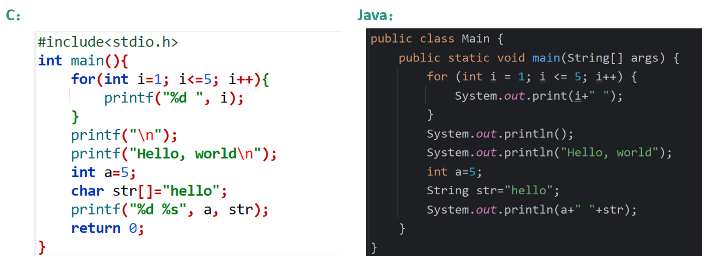

看看输出结果

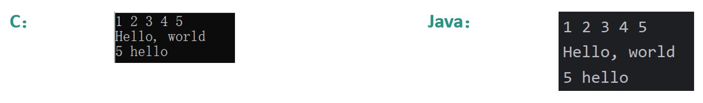

在基本语法上，Java与C语言十分相似，学习成本较低，对于现在的同学们来说比较容易上手，并且Java中一些常用的语法更加贴近我们的思维，可以在一定程度上提高编程效率，想要学习新语言又担心难度大的同学可以尝试！

### 什么是面向对象编程？

#### 系统地讲

- 面向对象编程（Object-OrientedProgramming，OOP）是一种计算机编程范式，它以“对象”作为程序的基本单元，将数据和操作（方法）组织在一起，以模拟真实世界中的实体和其相互关系。

- Java 是一种支持面向对象编程的编程语言，它在语言层面上提供了丰富的特性来实现面向对象的编程范式。

#### 通俗地讲

面向对象编程更贴合实际。例如，当我们需要用代码来描述一个学生的各种行为时，以前我们只能将它抽象为计算机中的数据，现在我们可以将它抽象为计算机里的一个“学生”。更加便利！

### 什么是对象，如何写类？

定义学生类的属性变量

```java
private int id;
private String name;
```

定义学生类的构造方法

```java
public Student() {
}
public Student(int id, String name) {
    this.id = id;
    this.name = name;
}
```

定义每个属性的get和set方法

```java
public int getId() {
    return id;
}
public void setId(int id) {
    this.id = id;
}
public String getName() {
    return name;
}
public void setName(String name) {
    this.name = name;
}
```

### 测试一下上面写好的类

测试代码如下：

```java
public class Test {
    public static void main(String[] args) {
        Student student1=new Student();
        student1.setId(10001);
        student1.setName("zhangsan");
        Student student2=new Student(10002,"lisi");
        System.out.println(student1.getId()+"   "+student1.getName());
        System.out.println(student2.getId()+"   "+student2.getName());
    }
}
```

运行输出结果：

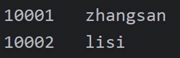

我们通过构建两个“学生”对象实现了相关信息的存储和输出，这种形式与曾经学过的“结构体”有点相似，可以类比学习。

### 从“学生类”到“窗口类”

创建一个窗口类：

```java
public class MyJFrame extends JFrame{
    public MyJFrame(){
        this.setSize(1000, 1000);//设置宽高
        this.setTitle("我是标题");//设置标题
        this.setDefaultCloseOperation(3);//设置关闭模式
        this.setLocationRelativeTo(null);//居中
        this.setAlwaysOnTop(true);//置顶
        this.setLayout(null);//取消内部默认布局
        this.setVisible(true);//设置为可见
    }
}
```

注意“extends JFrame”继承来自于java库中的窗口类，才能正确创建窗口。

### 向窗口中添加图片

我们刚刚创建的窗口十分单调，没有任何内容：


接下来，我们将一张图片添加到该java文件的目录下，并书写如下代码：

```java
JLabel background = new JLabel(new ImageIcon("..\\untitled\\src\\Test2\\tree.jpg"));
background.setBounds(0, 0, 1000, 562);
this.getContentPane().add(background);
```

运行之后，窗口就可以显示该图片了：


### 向窗口添加按钮

在添加图片之后，我们还可以继续向窗口中添加按钮，并使用相关方法让按钮响应你的操作

- 让窗口类在刚刚的“extends JFrame”之后，添加“implements MouseListener”,以为实现鼠标监听器接口，并在类中创建一个按钮作为属性：
  
  ```java
  public class MyJFrame extends JFrame implements MouseListener {
      JButton button=new JButton();
  ```

- 在构造方法中添加如下代码，向窗口加入按钮并设置按钮的相关属性：
  
  ```java
  button.setBounds(375,750,250,120);
  button.setText("我是按钮");
  button.setFont(new Font("华文彩云",button.getFont().getStyle(),50));
  button.addMouseListener(this);
  this.getContentPane().add(button);
  ```

- 完成本窗口对鼠标监听器方法的实现，获取此按钮的点击信息，并完成相关代码的执行（这里的代码是清除页面内容）：
  
  ```java
  public void mouseClicked(MouseEvent e) {
      if(e.getSource()==button) {
          this.getContentPane().removeAll();
          this.getContentPane().repaint();
      }
  }
  ```

- 执行点击前后如图所示：
  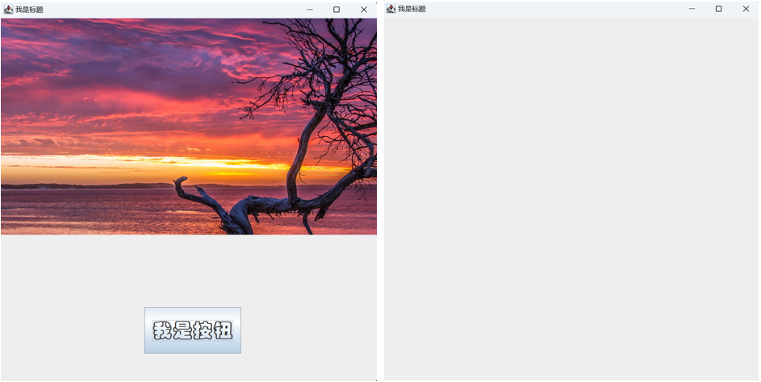
