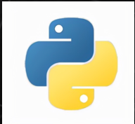
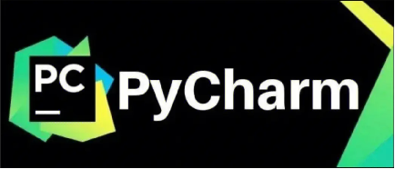
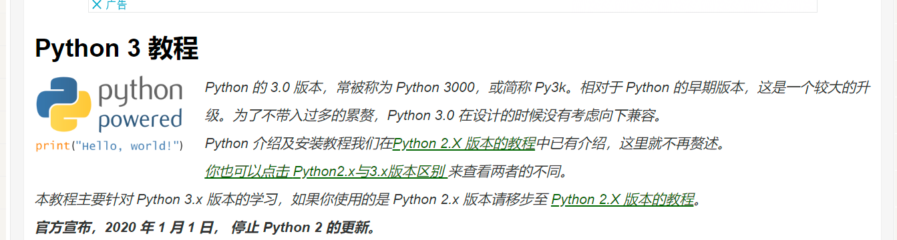
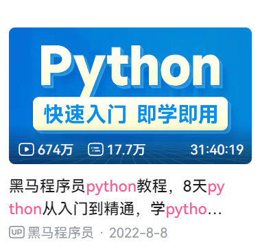
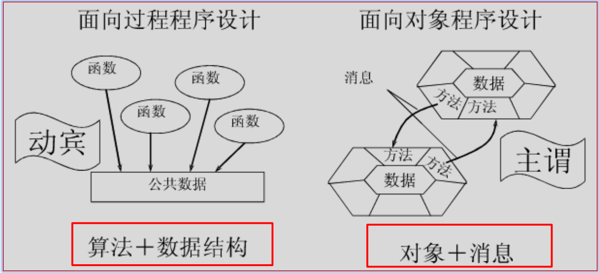
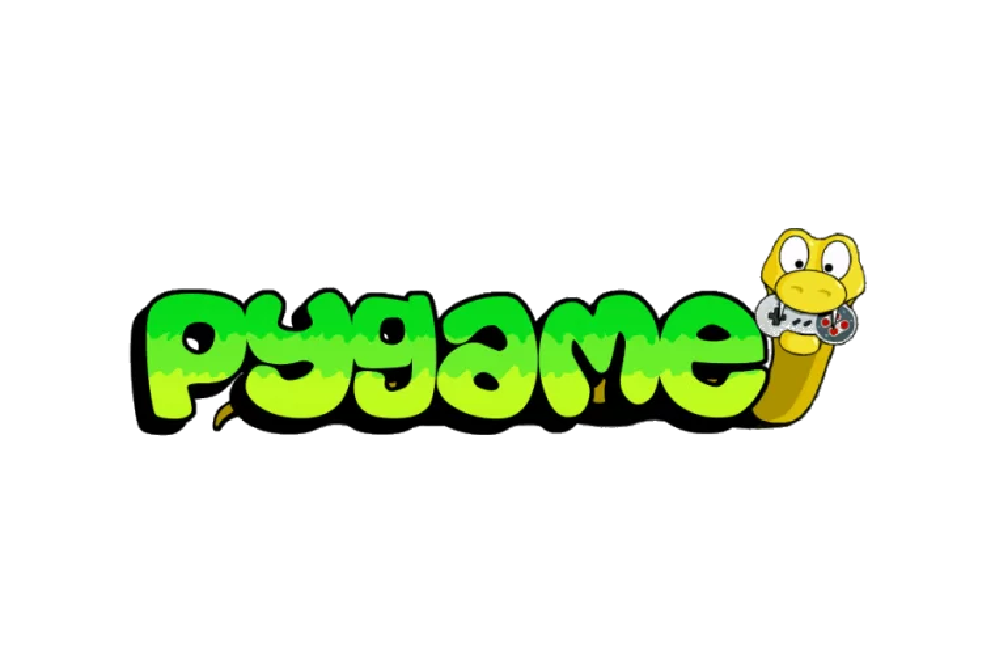
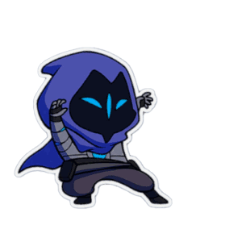
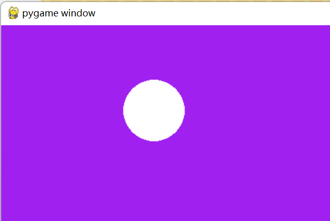
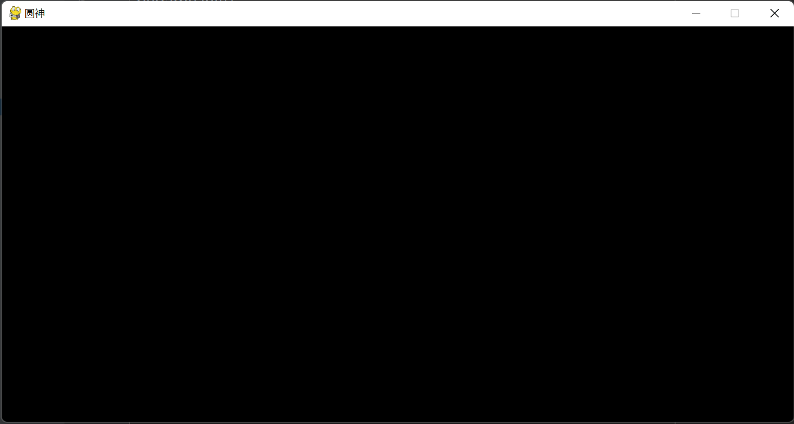
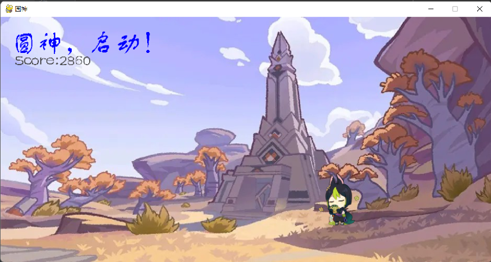

# 程序设计实践——Pygame

*pygame* 库*pygame* 是为开发 2D 游戏而设计的 Python 跨平台模块，该模块中定义了很多接口，开发人员使用这些接口可以方便地实现游戏开发的常用功能，比如图形和图像绘制、播放音频等等。

pygame第一版发布已经过去23年了，简单的2D游戏也难以用作一般的商用游戏，但对于编程的初学者，通过Pygame学习Python以及如何创作一个项目是极为有意思的。

pygame上手简单，可以作为入门游戏开发者不错的启蒙。

## 一、python与pygame

### 1.为什么选择python？

**简单**：Python是一种代表[简单主义](https://baike.baidu.com/item/简单主义/6711624?fromModule=lemma_inlink)思想的语言。阅读一个良好的Python程序就感觉像是在读英语一样。它使你能够专注于解决问题而不是去搞明白语言本身。

**易学**：Python极其容易上手，因为Python有极其简单的说明文档 。

**易读、易维护**：风格清晰划一、强制缩进

**用途广泛**

**速度较快：**Python的底层是用C语言写的，很多标准库和第三方库也都是用C写的，运行速度非常快。

**高层语言**：用Python语言编写程序的时候无需考虑诸如如何管理你的程序使用的内存一类的底层细节。

**可移植性**：由于它的开源本质，Python已经被移植在许多平台上（经过改动使它能够工作在不同平台上）。。

**面向对象**：Python既支持面向过程的编程也支持面向对象的编程。在“面向过程”的语言中，程序是由过程或仅仅是可重用代码的函数构建起来的。在“面向对象”的语言中，程序是由数据和功能组合而成的对象构建起来的。

**丰富的库**：Python标准库确实很庞大。它可以帮助处理各种工作，包括正则表达式、文档生成、单元测试、线程、数据库、[网页浏览器](https://baike.baidu.com/item/网页浏览器/8309940?fromModule=lemma_inlink)、CGI、FTP、[电子邮件](https://baike.baidu.com/item/电子邮件/111106?fromModule=lemma_inlink)、XML、XML-RPC、HTML、WAV文件、密码系统、GUI（图形用户界面）、Tk和其他与系统有关的操作。这被称作Python的“功能齐全”理念。除了标准库以外，还有许多其他高质量的库，如wxPython、Twisted和Python图像库等等。

**规范的代码：**Python采用强制缩进的方式使得代码具有较好可读性。而Python语言写的程序不需要编译成二进制代码。Python的作者设计限制性很强的语法，使得不好的编程习惯（例如if语句的下一行不向右缩进）都不能通过编译。其中很重要的一项就是Python的[缩进](https://baike.baidu.com/item/缩进/7337492?fromModule=lemma_inlink)规则。一个和其他大多数语言（如C）的区别就是，一个模块的界限，完全是由每行的首字符在这一行的位置来决定（而C语言是用一对大括号来明确的定出模块的边界，与字符的位置毫无关系）。通过强制程序员们缩进（包括if，for和函数定义等所有需要使用模块的地方），Python确实使得程序更加清晰和美观。

### 2.python开发工具

Python    推荐python3

https://www.python.org




[Python](https://baike.baidu.com/item/Python/407313?fromModule=lemma_inlink) [IDE](https://baike.baidu.com/item/IDE/8232086?fromModule=lemma_inlink)（Integrated Development Environment，[集成开发环境](https://baike.baidu.com/item/集成开发环境/298524?fromModule=lemma_inlink)）：

PyCharm    （学生申请可免费使用）

https://www.jetbrains.com/pycharm



### 3.python语法学习

菜鸟

https://www.runoob.com/python3/python3-tutorial.html



B站黑马程序员

https://www.bilibili.com/video/BV1qW4y1a7fU/?spm_id_from=333.337.search-card.all.click&vd_source=081a9428df91ab02baefa8f13719b00f



### 4.面向对象与面向过程

python作为一种同时支持面向对象编程和面向过程编程的语言，理解清晰，功能性强。我们不可避免地要去了解学习面向对象编程，以及面向对象的易于理解和实用性。那么什么是面向对象编程？面向对象编程与我们学习过的面向过程编程有什么异同之处？


//面向对象介绍与举例说明

面向对象是相对于[面向过程](https://baike.baidu.com/item/面向过程/9957246?fromModule=lemma_inlink)来讲的，[面向对象方法](https://baike.baidu.com/item/面向对象方法/216078?fromModule=lemma_inlink)，把相关的数据和方法组织为一个整体来看待，从更高的层次来进行系统[建模](https://baike.baidu.com/item/建模/814831?fromModule=lemma_inlink)，更贴近事物的自然运行模式。

在面向对象编程中，程序被组织成一系列相互作用的对象，每个对象都有自己的状态（属性）和行为（方法）。对象可以根据事物的特性进行抽象和定义，并通过类的方式来创建。类是一种对象的模板，它描述了对象具有的属性和方法。

面向对象编程的主要特点包括：

1. **封装（Encapsulation）**：封装将对象的属性和行为包装在一起，防止外部直接访问和修改对象的内部状态。通过提供公共接口（方法）来控制对对象的访问。
2. **继承（Inheritance）**：继承允许我们定义一个类，该类继承了另一个类的属性和方法。通过继承，子类可以复用父类的代码，并可以在此基础上进行修改或扩展。
3. **多态（Polymorphism）**：多态允许不同的对象对相同的消息做出不同的响应。即使对象属于不同的类，但通过相同的方法调用可以触发各个对象的不同行为。




面向对象和面向过程的比较：

面向对象：

- 数据和操作被封装为对象
- 将具有共性的对象抽象为类
- 类中数据由类中方法处理
- 对象通过接口与外界联系，对象间通过消息通信


面向过程：

- 顺序执行
- 数据和行为分离
- 顺序、分支、循环三种结构
- 模块间关系简单、功能上独立


### 5.什么是pygame？

Pygame是一个用于开发2D游戏和多媒体应用程序的Python库。它提供了一组功能强大的工具和函数，可以用来创建图形界面、处理用户输入、播放音频和视频、加载图像等。Pygame建立在SDL（Simple DirectMedia Layer）库之上，为开发者提供了方便的游戏开发环境。



pygame特点：

- 简单易用
- 功能丰富
- 2D开发

​	

## 二、游戏原理

### 1.电影的原理是什么？

每秒播放24帧（frame）图片，人的眼睛就会将其视为动态图。电影利用这种视觉效果，通过快速播放图片实现动态的效果。


### 2.游戏的原理是什么？

与电影原理类似，可以通过每秒播放很多帧的图片实现动态效果。 与电影不同的是，需要接收玩家输入改变游戏画面。



游戏运行的过程：

1. 检查玩家输入（event loop）
2. 根据信息绘制屏幕上的元素
3. 重复以上步骤


### 3.pygame能做什么？

pygame通过循环监听用户的动作，将游戏本身展示的内容以及用户进行交互的动作以很高的帧率绘制在屏幕上。从而实现构造一个可交互的电影，即游戏。


pygame具体功能：

- 绘制图像（以及播放声音）
- 检查玩家输入（在我们初学的时候，我们可能简单地认为检测输入只需运用如python中的input()函数，C中的scanf()函数即可实现输入交互操作，但应当注意的是，程序一旦运行到如input()这种输入函数，就会阻塞进程，程序处于暂停运行状态，游戏直到输入结束才能继续运行。但我们的游戏时刻都在流畅运行，并没有向使用input()函数一样在等待输入，所以我们之前学习的输入函数在游戏中肯定是无法使用的）
- 提供有用的工具，如碰撞检测（collisions），文本、计时器。


### 4.pygame与unity等引擎

Pygame提供了简单的游戏开发工具，但是没有复杂的功能，如果你想要开发3A大作，像GTA、战地等游戏，应该去学习更复杂的引擎（虚幻，Unity等）。(小学期应该没有佬手搓GTA吧)

| pygame           | unity                |
| ---------------- | -------------------- |
| 上手简单         | 学习曲线陡峭         |
| 常用于2D游戏开发 | 开发3D大型游戏       |
| 功能较少         | 功能强大，组件库丰富 |


## 三、简单pygame样例

### 1.40行即可创作一个可互动的小游戏！（太简单了可能算不上游戏）

代码如下：

```python
import pygame

pygame.init()
screen = pygame.display.set_mode((1280, 720))
clock = pygame.time.Clock()
running = True
dt = 0

player_pos = pygame.Vector2(screen.get_width() / 2, screen.get_height() / 2)

while running:
    for event in pygame.event.get():
        if event.type == pygame.QUIT:
            running = False

    screen.fill("purple")

    pygame.draw.circle(screen, "white", player_pos, 40)

    keys = pygame.key.get_pressed()
    if keys[pygame.K_w]:
        player_pos.y -= 300 * dt
    if keys[pygame.K_s]:
        player_pos.y += 300 * dt
    if keys[pygame.K_a]:
        player_pos.x -= 300 * dt
    if keys[pygame.K_d]:
        player_pos.x += 300 * dt

    pygame.display.flip()

    clock.tick(60)
    dt = 0.01

pygame.quit()
```

达成的效果如下，是一个简单的可操作的弹球小游戏。



在开发游戏的过程中，大家可以将小球换成自己角色的图片，更换背景图片，添加亿些细节，就可以完成属于自己的游戏啦

### 2.空窗口

是pygame最小系统，pygame制作游戏的基本逻辑如下：

```python
导入相关包
初始化pygame
设置窗口

while True:
    事件循环
    做一些处理
    更新显示
```

代码如下：

```python
import pygame
from sys import exit
import random

# 初始化 引擎
pygame.init()
# 设置屏幕  宽度800，高度400
screen = pygame.display.set_mode((942, 471))
# 设置标题
pygame.display.set_caption('圆神')

while True:
    # 事件循环
    for event in pygame.event.get():
        # 如果点击退出，则关闭程序
        if event.type == pygame.QUIT:
            pygame.quit()
            exit()
   
    pygame.display.update()
```

效果如下：



### 3.图片与文字

图片与文字的逻辑大致相似，整体思路为：

图片：

```python
定义一张图片，确定图片路径

将图片绘制到屏幕上
```

代码如下：

```python
background_surface = pygame.image.load('background.jpg')
player_surface = pygame.image.load('Tighnari.png')
enemy_surface = pygame.image.load('Sai Noi.png')、

screen.blit(background_surface, (0, 0))
screen.blit(enemy_surface, (enemy_x, enemy_y))
screen.blit(player_surface, (player_x, player_y))
```

文字：

```python
创建字体（font）

在表面上写文字

将文字放到显示表面上
```

代码如下：

```python
test_font = pygame.font.Font("FZSTK.TTF", 50)

text_surface = test_font.render("圆神，启动！", False, 'Blue')

screen.blit(text_surface, (20, 20))
```

最终效果如下：


### 4.键盘事件与碰撞检测

pygame自带按键检测工具，直接调用即可。
对于交互，此例中只需改变角色位置即可。（实在是太简单辣）

```python
keys = pygame.key.get_pressed()
    if keys[pygame.K_w]:
        player_y -= 300 * dt
    if keys[pygame.K_s]:
        player_y += 300 * dt
    if keys[pygame.K_a]:
        player_x -= 300 * dt
    if keys[pygame.K_d]:
        player_x += 300 * dt
```


碰撞检测可以简单地通过判断矩形是否重合从而判断是否碰撞，pygame自带精灵类这一工具，同学们可以自行了解。（涉及面向对象内容，需要使自定义类继承精灵类）

```python
def get_score():
    global score
    if enemy_x <= player_x <= (enemy_x + 100) and enemy_y <= player_y <= (enemy_y + 100):
        score += 1
    return score

def display_score():
    global score
    score_surf = score_font.render(f"Score:{score}", False, (64, 64, 64))
    screen.blit(score_surf, score_surf.get_rect(center=(100, 80)))
    return score
```


## 四、游戏语言

pygame由于只能制作简单的2D游戏而无法成为常见3A游戏的使用工具。但作为学习python的途径以及开发游戏的启蒙，pygame仍然是不错的选择。


2021年游戏项目中最常用的语言如下：

**C++**

C++ 是一种高级编程语言，用于构建最大的控制台和 Windows 游戏。它提供了大量的可扩展性，可以用于小型和大型的游戏项目，而且它是平台无关的，这意味着你可以简单地将项目从一个操作系统转移到另一个。C++ 无疑是游戏项目的最佳编程语言之一：《巫师3》、《黑暗之魂》、《上古卷轴 5：天际》、《PUBG》、《堡垒之夜》等都是用 C++ 创造的游戏项目。


**Java**

Java 是 1995 年创建的通用计算机编程中最好的面向对象的编程语言之一。Java 的建立是为了尽可能减少依赖关系，特别是与当时甚至现在的其他编程语言相比。Java 是顶级编程语言之一，它使游戏开发人员能够为每个平台构建游戏。它是 2021 年最流行的游戏项目编程语言之一： 《碟中谍III》、《Minecraft》、《FIFA 11》、《法拉利GT 3：世界赛道》等等都是用Java开发的游戏项目。


**C#**

在像 Unity 这样的游戏引擎中，C# 是你编码的编程语言，但 C++ 是引擎的核心。C# 是适用于 Windows 和 Xbox 游戏的最佳编程语言之一。Pokemon Go 和 Super Mario Run 是两个使用 C# 开发的流行游戏项目。


**HTML**

根据游戏开发商的说法，HTML5 是一个用于创建跨平台和跨浏览器应用程序和游戏的流行平台。它也可以与 JavaScript 互换使用。HTML 是一种简单易学的编程语言，不需要对算法有广泛的编程理解，这使其成为游戏设计师的一个突出选择。

